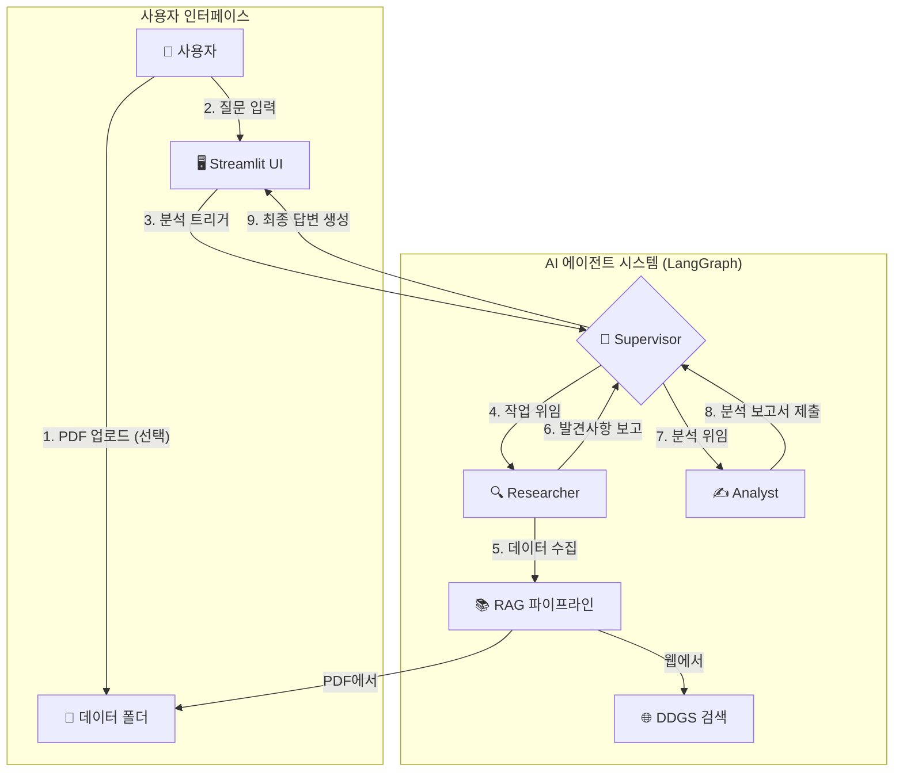

# AI 한국은행 경제 분석팀 - LangGraph 기반 협업형 멀티 에이전트 시스템

## 📋 프로젝트 개요

본 프로젝트는 LangChain 및 LangGraph 최신 기술을 활용하여, 다양한 전문성을 가진 AI 에이전트들이 협업해 경제 관련 질문에 대한 심층 분석 결과를 제공하는 **Streamlit 기반 멀티페이지 웹 애플리케이션**입니다.

### 🎯 주요 특징

- **🧠 멀티 에이전트 협업**: Supervisor-Worker 아키텍처로 전문적인 경제 분석
- **📚 고급 RAG 시스템**: FAISS + MultiQueryRetriever로 정확한 정보 검색
- **🌐 실시간 웹 검색**: 최신 경제 정보 수집 및 분석
- **📱 현대적 UI/UX**: Streamlit 네이티브 컴포넌트 우선 사용으로 안정적이고 일관된 인터페이스
- **⚙️ 모듈화된 아키텍처**: 유지보수성과 확장성을 고려한 체계적 구조

## 🛠️ 기술 스택

### 핵심 기술
- **AI Agent Framework**: LangChain, LangGraph (v0.2.x / v0.3.x 호환)
- **LLM**: Azure OpenAI Service (GPT-4o)
- **UI/UX**: Streamlit (멀티페이지 구조)
- **RAG**: FAISS VectorStore, MultiQueryRetriever, ContextualCompressionRetriever, 동적 PDF 로딩
- **웹 검색**: DDGS (DuckDuckGo Search) - SSL 인증서 오류 해결
- **검색 전략**: MMR (Maximum Marginal Relevance) + 완화된 유사도 검색

### 개발 도구
- **패키지 관리**: uv (권장) 또는 pip
- **환경 관리**: python-dotenv
- **로깅**: Python logging 모듈
- **상태 관리**: Streamlit Session State

## 🏗️ 시스템 아키텍처

### 멀티 에이전트 워크플로우



### 에이전트 역할

- **🧠 Supervisor (감독관)**: 전체 분석 계획 수립 및 워크플로우 관리
  - 라우팅 규칙: `ROUTE: researcher` | `ROUTE: analyst` | `ROUTE: END`
  - 최종 답변: `Final Answer: ...` 형식으로 직접 제공
- **🔍 Researcher (연구원)**: MultiQueryRetriever 기반 RAG와 웹 검색으로 사실 기반 데이터 수집
- **✍️ Analyst (분석가)**: 수집된 데이터를 바탕으로 경제 현상 심층 분석 및 통찰 제공

## 📁 프로젝트 구조

```
final/
├── app.py                     # 메인 애플리케이션 진입점
├── pages/                     # Streamlit 멀티페이지
│   ├── 01_⚙️_설정.py         # 설정 및 환경 검증 페이지
│   └── 02_📖_도움말.py       # 사용 가이드 및 FAQ 페이지
├── components/                # 재사용 가능한 UI 컴포넌트
│   ├── __init__.py
│   ├── sidebar.py            # 사이드바 컴포넌트
│   ├── chat_interface.py     # 채팅 인터페이스 컴포넌트
│   └── common.py             # 공통 UI 컴포넌트
├── core/                     # 핵심 비즈니스 로직
│   ├── __init__.py
│   ├── config.py             # 설정 관리
│   ├── logger.py             # 로깅 시스템
│   ├── model_factory.py      # Azure OpenAI 모델 팩토리
│   ├── web_search.py         # 웹 검색 도구
│   ├── rag_pipeline.py       # RAG 파이프라인
│   └── state_manager.py      # 세션 상태 관리
├── utils/                    # 유틸리티 함수
│   ├── __init__.py
│   ├── helpers.py            # 헬퍼 함수
│   └── env_validator.py      # 환경 변수 검증
├── data/                     # PDF 데이터 및 FAISS 인덱스
├── .streamlit/               # Streamlit 설정
│   └── config.toml          # 테마 및 서버 설정
├── requirements.txt          # Python 의존성
├── .env.example             # 환경 변수 템플릿
└── README.md                # 프로젝트 문서
```

## 🚀 설치 및 실행

### 1. 사전 준비

- **Azure OpenAI Service** 엔드포인트 및 API 키
- **uv** 설치 (권장)
  ```bash
  # macOS/Linux
  curl -LsSf https://astral.sh/uv/install.sh | sh
  
  # macOS (Homebrew)
  brew install uv
  ```

### 2. 프로젝트 클론 및 설정

```bash
# 프로젝트 클론
git clone [repository-url]
cd [repository-name]

# 가상환경 생성 및 활성화
uv venv
source .venv/bin/activate  # Windows: .venv\Scripts\activate

# 의존성 설치
uv pip install -r requirements.txt
```

### 3. 환경 변수 설정

`.env.example`을 `.env`로 복사하고 Azure OpenAI 정보를 입력합니다:

```bash
cp .env.example .env
```

```env
# Azure OpenAI 설정 (필수)
AOAI_ENDPOINT="YOUR_AZURE_OPENAI_ENDPOINT"
AOAI_API_KEY="YOUR_AZURE_OPENAI_API_KEY"
AOAI_DEPLOY_GPT4O="YOUR_GPT-4O_DEPLOYMENT_NAME"
AOAI_DEPLOY_EMBEDDING_3_LARGE="YOUR_EMBEDDING_DEPLOYMENT_NAME"

# 로깅 설정 (선택)
LOG_LEVEL=INFO

# RAG 설정 (선택)
RAG_CHUNK_SIZE=1000
RAG_CHUNK_OVERLAP=200
RAG_SEARCH_STRATEGY=MMR
RAG_K=5
RAG_FETCH_K=20
RAG_LAMBDA_MULT=0.5

# 웹 검색 설정 (선택)
# 기본 검색 엔진을 사용합니다.

# 디버그 설정 (선택)
DEBUG_MODE=False
```

### 4. 애플리케이션 실행

```bash
# 메인 애플리케이션 실행
streamlit run app.py

# 또는 uv로 실행
uv run streamlit run app.py
```

## 📱 사용 방법

### 메인 페이지 (채팅 인터페이스)
- **질문 입력**: 경제 관련 질문을 자연어로 입력
- **PDF 업로드**: 사이드바에서 분석할 PDF 파일 업로드
- **실시간 분석**: 에이전트들의 협업 과정을 실시간으로 확인
- **결과 확인**: 최종 분석 결과 및 근거 확인

### 설정 페이지 (⚙️)
- **환경 설정 확인**: 필수 환경 변수 및 설정 검증
- **시스템 정보**: Python 버전, 플랫폼, 데이터 디렉토리 상태
- **세션 상태 관리**: 현재 세션 정보 및 초기화 기능
- **설정 가이드**: 환경 설정 방법 안내

### 도움말 페이지 (📖)
- **시작 가이드**: 애플리케이션 사용 방법
- **경제 분석 가이드**: 에이전트 역할 및 분석 과정 설명
- **기능 소개**: RAG, 웹 검색, 문서 관리 기능 설명
- **FAQ**: 자주 묻는 질문 및 해결 방법

## 🔧 주요 기능

### 1. 고급 RAG 시스템
- **MultiQueryRetriever**: 단일 질문을 다각도로 재구성하여 검색 성능 극대화
- **동적 PDF 관리**: 업로드된 PDF를 자동으로 RAG 파이프라인에 반영
- **완화된 검색 전략**: 기본 검색 실패 시 더 넓은 범위에서 재검색
- **컨텍스트 압축**: LLMChainExtractor를 통한 관련성 높은 정보 추출
- **캐시 최적화**: 파일명+수정시간 기반 캐시로 성능 향상

### 2. 실시간 웹 검색
- **DDGS 통합**: 최신 경제 정보 및 뉴스 수집
- **SSL 인증서 오류 해결**: `verify=False` 설정으로 안정적인 검색 제공
- **안정적인 백엔드**: google, brave, duckduckgo 백엔드만 사용하여 검색 안정성 향상
- **검색 결과 분석**: 수집된 정보의 신뢰성 및 관련성 평가

### 3. 멀티 에이전트 협업
- **Supervisor-Worker 패턴**: 체계적인 작업 분담 및 관리
- **상태 기반 라우팅**: 텍스트 기반 동적 워크플로우 제어
- **2단계 검색 전략**: 기본 검색 실패 시 완화된 유사도 검색으로 재시도
- **메시지 처리 개선**: 다양한 메시지 타입 지원으로 안정적인 응답 수집
- **오류 처리**: 안정적인 예외 처리 및 복구 메커니즘

### 4. 현대적 UI/UX
- **Streamlit 네이티브 컴포넌트 우선**: CSS 의존성 제거로 안정적이고 일관된 인터페이스
- **멀티페이지 구조**: 체계적인 기능 분리 및 네비게이션
- **반응형 디자인**: 다양한 화면 크기에 최적화
- **실시간 피드백**: 진행 상황 및 상태 시각화

## 🏛️ 아키텍처 개선사항

### 모듈화 및 구조화
- **단일 파일 분리**: 1,500줄+ 단일 파일을 체계적 모듈로 분리
- **관심사 분리**: UI, 비즈니스 로직, 유틸리티의 명확한 분리
- **재사용성**: 공통 컴포넌트 및 유틸리티 함수 모듈화

### 상태 관리 개선
- **StateManager 클래스**: 세션 상태 관리 중앙화
- **일관된 상태 접근**: 표준화된 상태 조작 인터페이스
- **상태 검증**: 환경 변수 및 설정 자동 검증

### 설정 관리 표준화
- **환경 변수 검증**: EnvironmentValidator 클래스로 포괄적 검증
- **설정 파일**: `.streamlit/config.toml`로 테마 및 서버 설정
- **설정 요약**: 현재 설정 상태의 시각적 표현

## 🔍 개발 및 디버깅

### 로깅 시스템
```python
# 로그 레벨 설정
LOG_LEVEL=DEBUG  # 상세 로그
LOG_LEVEL=INFO   # 일반 로그
```

### 주요 로그 접두사
- `[env]`: 환경 설정 관련
- `[model]`: Azure OpenAI 모델 관련
- `[rag]`: RAG 파이프라인 관련
- `[supervisor]`: Supervisor 에이전트 관련
- `[agent-node:<name>]`: 특정 에이전트 관련
- `[run]`: 실행 흐름 관련

### 디버깅 도구
- **환경 검증**: 설정 페이지에서 포괄적 환경 검증
- **상태 확인**: 세션 상태 및 설정 정보 실시간 확인
- **그래프 재구성**: 캐시된 그래프/RAG 초기화 기능

## 🚨 트러블슈팅

### 일반적인 문제

1. **400 오류 (tool_calls 관련)**
   - **원인**: Supervisor tool_calls 미응답
   - **해결**: 텍스트 라우팅 방식으로 해결됨

2. **최종 응답이 비어있는 경우**
   - **원인**: Analyst 경로 메시지 수집 문제
   - **해결**: 다양한 메시지 타입 지원 및 2단계 검색 전략으로 해결

3. **SSL 인증서 검증 실패 (CERTIFICATE_VERIFY_FAILED)**
   - **원인**: DDGS 웹 검색에서 자체 서명된 인증서 사용
   - **해결**: `verify=False` 설정 및 안정적인 백엔드만 사용

4. **RAG 반복 빌드**
   - **원인**: PDF 리스트 변경 또는 수정시간 변경
   - **해결**: "🔄 그래프 재구성" 버튼으로 초기화

5. **로그 부족**
   - **해결**: `.env`에서 `LOG_LEVEL=DEBUG` 설정

### 환경 설정 문제

1. **Azure OpenAI 연결 실패**
   - 엔드포인트 및 API 키 확인
   - 배포명 정확성 확인

2. **PDF 업로드 실패**
   - 파일 형식 확인 (PDF만 지원)
   - 파일 크기 확인 (200MB 제한)

## 📈 성능 최적화

### RAG 성능
- **캐시 전략**: 파일명+수정시간 기반 캐시 키
- **청크 최적화**: 적절한 청크 크기 및 오버랩 설정
- **검색 전략**: MMR (Maximal Marginal Relevance) 및 완화된 유사도 검색
- **컨텍스트 압축**: LLMChainExtractor로 관련성 높은 정보만 추출

### 메모리 관리
- **세션 상태 정리**: 불필요한 데이터 자동 정리
- **캐시 관리**: 효율적인 캐시 키 전략
- **리소스 해제**: 사용 완료된 리소스 자동 해제

## 🆕 최근 주요 개선사항 (v2.1)

### 🔒 SSL 인증서 오류 완전 해결
**문제**: DDGS 웹 검색에서 `CERTIFICATE_VERIFY_FAILED` 오류 발생
```python
# Before: TLS 핸드셰이크 실패
with DDGS() as ddgs:
    results = ddgs.text(query, max_results=5)

# After: SSL 검증 비활성화 및 안정적인 백엔드 사용
with DDGS(verify=False) as ddgs:
    results = ddgs.text(query, max_results=5, backend="google,brave,duckduckgo")
```

### 🔍 2단계 검색 전략 구현
**기본 검색 실패 시 완화된 검색으로 재시도**
```python
# 1단계: 기본 검색 (정확한 유사도)
base_retriever = create_mmr_retriever(k=5, score_threshold=0.7)

# 2단계: 완화된 검색 (더 넓은 범위)
relaxed_retriever = create_relaxed_retriever(k=10, score_threshold=0.3)
```

### 💬 메시지 처리 개선
**다양한 메시지 타입 지원으로 안정적인 응답 수집**
```python
# 다양한 메시지 타입 처리
if hasattr(msg, 'content'):
    content = msg.content.strip()
elif isinstance(msg, dict) and 'content' in msg:
    content = msg['content'].strip()
elif hasattr(msg, 'text'):
    content = msg.text.strip()
else:
    content = str(msg).strip()
```

### 🧠 에이전트 워크플로우 최적화
- **Supervisor 라우팅 강화**: 더 정확한 에이전트 전환
- **메시지 필터링**: "ROUTE:" 메시지 자동 제외
- **폴백 로직**: 최종 응답 수집 실패 시 대체 메시지 제공

## 🔄 변경 이력

### v2.2 (최신) - UI/UX 개선 및 코드 정리
- ✅ **Streamlit 네이티브 컴포넌트 전환**: CSS 의존성 완전 제거로 안정성 향상
- ✅ **사용하지 않는 코드 제거**: 7개 미사용 함수 및 주석 처리된 코드 정리
- ✅ **사이드바 레이아웃 개선**: 컨트롤 패널 최상단 이동 및 펼친 상태 유지
- ✅ **헤더 고정 구현**: 최상단 고정 헤더로 사용성 향상
- ✅ **참고자료 리스트 개선**: 접힘 기능 제거 및 스크롤 기능 추가

### v2.1 - 안정성 및 성능 개선
- ✅ **SSL 인증서 오류 해결**: DDGS 웹 검색의 TLS 핸드셰이크 실패 문제 완전 해결
- ✅ **2단계 검색 전략**: 기본 검색 실패 시 완화된 유사도 검색으로 재시도
- ✅ **메시지 처리 개선**: 다양한 메시지 타입 지원으로 안정적인 응답 수집
- ✅ **완화된 RAG 검색**: 더 넓은 범위에서 관련 정보 검색 가능
- ✅ **에이전트 워크플로우 최적화**: Supervisor 라우팅 및 메시지 처리 로직 강화

### v2.0 - 구조 표준화 및 리팩토링
- ✅ **모듈화 완료**: 단일 파일을 체계적 모듈 구조로 분리
- ✅ **멀티페이지 구조**: Streamlit 표준 멀티페이지 기능 구현
- ✅ **컴포넌트 재사용성**: 공통 UI 컴포넌트 시스템 구축
- ✅ **상태 관리 중앙화**: StateManager 클래스로 일관된 상태 관리
- ✅ **환경 설정 표준화**: 환경 변수 검증 및 관리 시스템
- ✅ **설정 파일 표준화**: `.streamlit/config.toml` 설정 파일 구현
- ✅ **OPENROUTER_API_KEY 제거**: 웹 검색을 기본 검색 엔진으로 변경

### v1.0 - 초기 버전
- Supervisor: tool_calls → 텍스트 라우팅으로 전환
- Worker: tool_calls 없을 때도 직접 실행하도록 보완
- UI: Analyst 메시지 최종 응답 수집, 업로더 무한 재실행 방지
- RAG: 파일명+mtime 기반 캐시 키, `@st.cache_resource` 최적화

## 📞 지원 및 문의

프로젝트 관련 문의사항이나 버그 리포트는 이슈 트래커를 통해 제출해 주세요.

---

**AI 한국은행 경제 분석팀** - LangGraph 기반 협업형 멀티 에이전트 시스템
