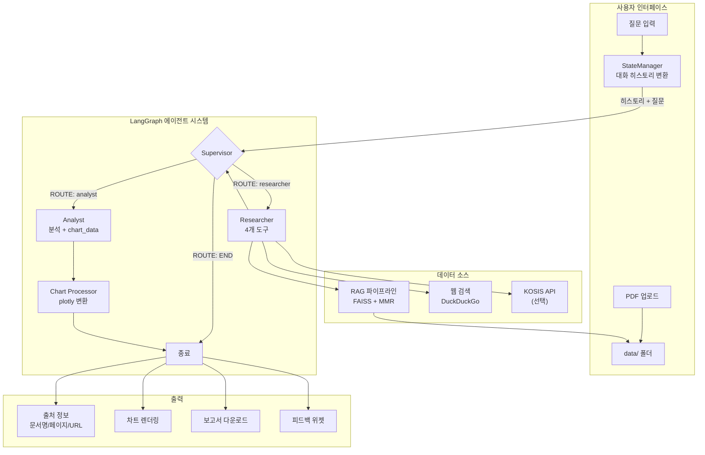
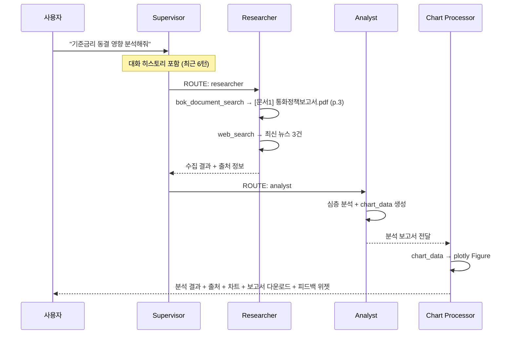
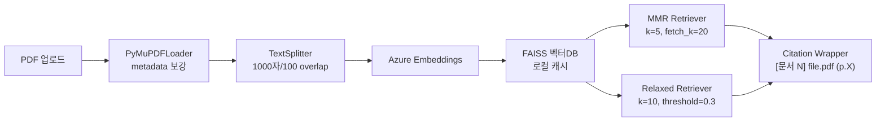

# AI 한국은행 경제 분석팀

> LangGraph 기반 협업형 멀티 에이전트 경제 분석 시스템 (v2.4)

## 프로젝트 개요

AI 에이전트 팀(Supervisor, Researcher, Analyst)이 협업하여 경제 질문에 대한 심층 분석을 제공하는 Streamlit 웹 애플리케이션입니다. 사용자가 PDF 문서를 업로드하고 자연어로 질문하면, RAG 파이프라인과 웹 검색을 결합하여 근거 기반 분석 보고서를 생성합니다.

### 설계 의도

이 시스템은 **"단일 LLM 호출로는 달성하기 어려운 복합 경제 분석"** 을 해결하기 위해 설계되었습니다.

```
기존 방식: 사용자 → LLM → 답변 (출처 불명, 환각 위험)

본 시스템: 사용자 → Supervisor(계획) → Researcher(근거 수집) → Analyst(심층 분석) → 답변
                                          ↑                        ↑
                                     RAG + 웹 + KOSIS         차트 자동 생성
                                     (출처 추적 포함)          (데이터 시각화)
```

**핵심 설계 원칙:**
1. **근거 기반 분석** : 모든 분석은 검색된 문서/데이터에 기반하며, 출처(문서명, 페이지, URL)를 명시합니다
2. **역할 분리** : 정보 수집(Researcher)과 분석(Analyst)을 분리하여 각 단계의 품질을 보장합니다
3. **동적 라우팅** : Supervisor가 질문의 성격에 따라 최적의 에이전트 경로를 판단합니다
4. **투명한 과정** : 에이전트 진행 상황을 실시간으로 표시하여 사용자 신뢰를 확보합니다

### 주요 특징

- **멀티 에이전트 협업** : Supervisor-Worker 아키텍처, 텍스트 기반 라우팅
- **고급 RAG** : FAISS + MMR/유사도 검색, 2단계 폴백, 출처(문서명/페이지) 자동 추적
- **대화 히스토리** : 이전 대화 맥락을 활용한 연속 질문 지원 (최근 6턴)
- **차트 시각화** : Analyst 응답의 수치 데이터를 plotly 차트로 자동 변환 (단일/멀티시리즈)
- **보고서 다운로드** : 분석 결과를 Markdown 보고서로 내보내기
- **사용자 피드백** : 좋아요/싫어요 위젯으로 응답 품질 수집
- **KOSIS 연동** : 국가통계포털 API로 공식 경제 통계 조회 (선택)
- **실시간 웹 검색** : DuckDuckGo 기반 최신 경제 정보 수집

## 기술 스택

| 레이어 | 기술 |
|--------|------|
| UI | Streamlit (멀티페이지, 네이티브 컴포넌트) |
| 에이전트 오케스트레이션 | LangGraph (StateGraph) |
| LLM 프레임워크 | LangChain |
| LLM | Azure OpenAI GPT-4o |
| 임베딩 | Azure OpenAI text-embedding-3-large |
| 벡터DB | FAISS (로컬 캐시) |
| PDF 처리 | PyMuPDF |
| 웹 검색 | DDGS (DuckDuckGo) |
| 차트 | plotly |
| 통계 API | KOSIS (선택) |

## 시스템 아키텍처



### 에이전트 역할

| 에이전트 | 역할 | 도구 |
|---------|------|------|
| **Supervisor** | 라우팅 결정, 반복/타임아웃 관리, 대화 맥락 인식 | 없음 (텍스트 출력만) |
| **Researcher** | 정보 수집, 출처 추적, 2단계 검색 전략 | `bok_document_search`, `web_search`, `relaxed_document_search`, `kosis_statistics_search` |
| **Analyst** | 심층 분석, 보고서 작성, 차트 데이터 생성 | 없음 (최종 응답 전용) |
| **Chart Processor** | Analyst 응답에서 chart_data 추출 → plotly 변환 | 자동 실행 (Analyst 후단) |

### 작동 흐름: 질문에서 답변까지



### RAG 파이프라인



## 프로젝트 구조

```
├── app.py                          # 메인 앱 + 에이전트 + 그래프 정의
├── core/                           # 핵심 비즈니스 로직
│   ├── config.py                   # 환경변수 및 설정 (Config 클래스)
│   ├── logger.py                   # 구조화된 로깅
│   ├── model_factory.py            # Azure OpenAI 모델 팩토리 (싱글톤)
│   ├── rag_pipeline.py             # RAG: PDF → FAISS → Retriever
│   ├── state_manager.py            # Streamlit 세션 상태 중앙 관리
│   ├── web_search.py               # DuckDuckGo 웹 검색 + 재시도
│   ├── citation.py                 # Retriever → 출처 포함 텍스트 변환
│   ├── feedback.py                 # 피드백 JSONL 저장/통계
│   ├── chart_generator.py          # LLM 응답 → plotly 차트 (단일/멀티시리즈)
│   ├── report_generator.py         # 분석 결과 → Markdown 보고서
│   └── kosis_client.py             # KOSIS 통계청 API 클라이언트
├── components/                     # UI 컴포넌트
│   ├── sidebar.py                  # 사이드바 (컨트롤/업로드/참고자료/PDF뷰어)
│   ├── chat_interface.py           # 채팅 메시지 + 출처 렌더링
│   └── common.py                   # 공통 컴포넌트 + PDF 페이지 뷰어
├── utils/                          # 유틸리티
│   ├── helpers.py                  # 출처 추출/포맷/평가
│   └── env_validator.py            # 환경 변수 검증
├── pages/                          # Streamlit 멀티페이지
│   ├── 01_⚙️_설정.py              # 설정 + 환경검증 + 피드백통계
│   └── 02_📖_도움말.py            # 사용 가이드 + FAQ
├── data/                           # PDF 문서 + FAISS 캐시 + 피드백 기록
├── docs/
│   ├── ARCHITECTURE.md             # 상세 아키텍처 문서 (Mermaid 12개)
│   └── plans/                      # 구현 계획 문서
├── requirements.txt                # Python 의존성 (91개 패키지)
└── env.example                     # 환경 변수 템플릿
```

## 설치 및 실행

### 사전 준비

- Azure OpenAI Service 엔드포인트 및 API 키
- Python 3.9+
- [uv](https://docs.astral.sh/uv/) (권장) 또는 pip

### 설정

```bash
git clone https://github.com/SukbeomH/Wiki-multiagents.git
cd Wiki-multiagents

# 가상환경 생성 및 의존성 설치
uv venv && source .venv/bin/activate
uv pip install -r requirements.txt

# 환경 변수 설정
cp env.example .env
# .env 파일을 열고 Azure OpenAI 정보 입력
```

### 실행

```bash
streamlit run app.py
# 또는
uv run streamlit run app.py
```

## 환경 변수

```env
# === 필수 ===
AOAI_ENDPOINT=https://your-resource.openai.azure.com/
AOAI_API_KEY=your-api-key
AOAI_DEPLOY_GPT4O=gpt-4o
AOAI_DEPLOY_EMBED_3_LARGE=text-embedding-3-large

# === 앱 설정 (선택) ===
MAX_ITERATIONS=10              # 에이전트 최대 반복 (기본: 10)
TIMEOUT_SECONDS=300            # 실행 타임아웃 초 (기본: 300)
MAX_HISTORY_TURNS=6            # 대화 히스토리 턴 수 (기본: 6)
LOG_LEVEL=INFO                 # 로그 레벨 (기본: INFO)

# === RAG 설정 (선택) ===
RAG_SEARCH_STRATEGY=mmr        # 검색 전략: mmr 또는 similarity (기본: mmr)
RAG_K=5                        # 검색 결과 수 (기본: 5)
RAG_FETCH_K=20                 # MMR 후보 수 (기본: 20)
RAG_LAMBDA_MULT=0.7            # MMR 다양성 계수 (기본: 0.7)
RAG_SCORE_THRESHOLD=0.7        # 유사도 임계값 (기본: 0.7)
RAG_USE_COMPRESSION=false      # 컨텍스트 압축 (기본: false)

# === 외부 연동 (선택) ===
KOSIS_API_KEY=                 # KOSIS 통계청 API 키 (https://kosis.kr/openapi/)
```

## 사용 방법

### 기본 분석 흐름

1. (선택) 사이드바에서 PDF 문서 업로드
2. 채팅창에 경제 질문 입력 (예: "기준금리 동결이 경제에 미치는 영향은?")
3. 에이전트 협업 과정 실시간 확인 (Supervisor → Researcher → Analyst)
4. 분석 결과 확인: 본문 + 출처 정보 + 차트 (해당 시)
5. 보고서 다운로드 또는 피드백 제출

### 연속 분석

이전 대화를 참조하여 연속 질문이 가능합니다:
- "아까 분석에서 이어서, 금리가 경제에 미치는 영향은?"
- "위에서 언급한 GDP 수치를 좀 더 자세히 분석해줘"

### 차트 시각화

Analyst가 수치 데이터를 포함한 분석을 생성하면 자동으로 plotly 차트가 렌더링됩니다. 단일 지표 및 여러 지표 비교(멀티시리즈) 모두 지원합니다.

### PDF 출처 딥링크

출처 정보에서 **[📖 보기]** 버튼을 클릭하면 해당 PDF의 해당 페이지를 바로 열람할 수 있습니다.

### 멀티페이지

| 페이지 | 내용 |
|--------|------|
| 메인 | 채팅 인터페이스, 분석 실행, 결과 표시 |
| ⚙️ 설정 | 환경 검증, RAG/앱 설정 확인, 피드백 통계 |
| 📖 도움말 | 사용 가이드, 에이전트 역할 설명, FAQ |

## 개발 및 디버깅

### 로그 접두사

| 접두사 | 영역 |
|--------|------|
| `[env]` | 환경 설정 |
| `[model]` | Azure OpenAI 모델 |
| `[rag]` | RAG 파이프라인 |
| `[supervisor]` | Supervisor 라우팅 |
| `[agent-node:<name>]` | 에이전트 실행 |
| `[chart]` | 차트 생성 |
| `[feedback]` | 피드백 저장 |
| `[report]` | 보고서 생성 |
| `[kosis]` | KOSIS API |
| `[run]` | 스트림 실행 흐름 |
| `[state]` | 세션 상태 변경 |

### 트러블슈팅

| 문제 | 해결 |
|------|------|
| Azure OpenAI 연결 실패 | `.env`에서 엔드포인트/API 키/배포명 확인 |
| SSL 인증서 검증 실패 | DDGS `verify=False`로 자동 해결됨 |
| 최종 응답이 비어있음 | 2단계 검색 + 폴백 로직으로 자동 처리됨 |
| RAG 반복 빌드 | 사이드바 "🔄 그래프 재구성" 클릭 |
| 로그 상세 확인 | `.env`에서 `LOG_LEVEL=DEBUG` 설정 |

## 변경 이력

### v2.4 (최신) - Phase 3
- 대화 히스토리 연속 분석 (최근 6턴, Supervisor 맥락 인식)
- 멀티시리즈 차트 (series 배열로 여러 지표 비교)
- PDF 출처 딥링크 (페이지 번호 클릭 → PDF 뷰어)
- 분석 보고서 Markdown 다운로드

### v2.3 - Phase 2
- 답변 출처 명시 (문서명/페이지/URL 구조화)
- 사용자 피드백 (좋아요/싫어요 + 통계 대시보드)
- plotly 차트 자동 생성
- KOSIS 국가통계포털 연동

### v2.2 - UI/UX
- Streamlit 네이티브 컴포넌트 전환 (CSS 제거)
- 사이드바/헤더/참고자료 UI 개선
- 미사용 코드 정리

### v2.1 - 안정성
- SSL 인증서 오류 해결
- 2단계 검색 전략 (기본 → 완화된 검색)
- 메시지 타입 처리 개선

### v2.0 - 구조화
- 모듈화 (단일 파일 → core/components/utils 분리)
- StateManager 중앙화, 환경 변수 검증
- Streamlit 멀티페이지 구조

### v1.0 - 초기
- Supervisor 텍스트 라우팅, RAG 캐시, 기본 UI

## 상세 문서

- **[ARCHITECTURE.md](docs/ARCHITECTURE.md)** : 데이터 워크플로우, 시나리오별 시퀀스 다이어그램, 모듈 의존성 (Mermaid 12개)
- **[PRD.txt](PRD.txt)** : 제품 요구사항 정의서

---

**AI 한국은행 경제 분석팀** - LangGraph 기반 협업형 멀티 에이전트 시스템
