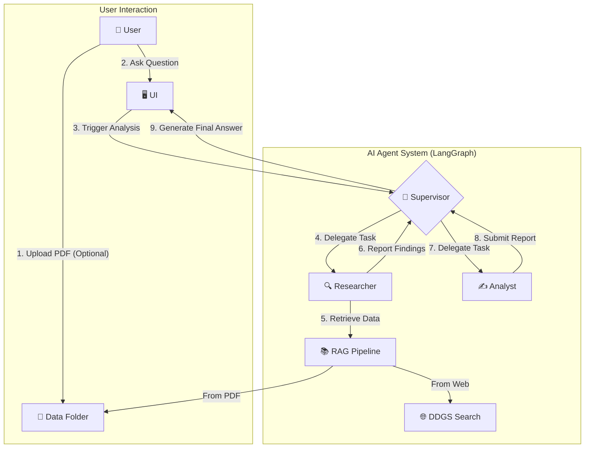

## LangGraph 기반 협업형 경제 분석 멀티 에이전트 시스템

### 1. 프로젝트 개요

본 프로젝트는 LangChain 및 LangGraph 최신 기술을 활용하여, 다양한 전문성을 가진 AI 에이전트들이 협업해 경제 관련 질문에 대한 심층 분석 결과를 제공하는 Streamlit 기반 웹 애플리케이션입니다.

### 2. 핵심 기술 스택

- **AI Agent Framework**: LangChain, LangGraph (v0.2.x / v0.3.x 호환)
- **LLM**: Azure OpenAI Service (gpt-4o)
- **UI/UX**: Streamlit
- **RAG**: FAISS VectorStore, MultiQueryRetriever, Dynamic PDF Loading
- **Tools**: DDGS (Web Search)

### 3. 시스템 아키텍처

본 시스템은 실제 분석팀의 업무 프로세스를 모방한 Supervisor-Worker 멀티 에이전트 아키텍처를 채택합니다. `StateGraph` 를 통해 각 에이전트 간 상태와 작업 흐름을 정교하게 제어합니다.



- **🧠 Supervisor(감독관)**: 사용자의 질문을 받아 전체 계획을 수립하고, 상황에 맞는 Worker 에이전트(Researcher, Analyst)에게 작업을 동적으로 할당·조율합니다.
- **🔍 Researcher(연구원)**: `MultiQueryRetriever` 기반 고급 RAG와 웹 검색(`ddgs`)을 통해 업로드 PDF 및 최신 외부 정보를 수집해 사실 기반 데이터를 제공합니다.
- **✍️ Analyst(분석가)**: 수집된 데이터를 바탕으로 경제 현상을 심층 분석하고 최종 통찰과 답변을 생성합니다.

### 4. 핵심 기능 및 심화 내용

#### 🎯 과제 평가 기준 충족

- **Prompt Engineering**: 각 에이전트(Supervisor, Researcher, Analyst)의 역할을 명확히 정의하고, 오류 처리 지침을 포함한 시스템 프롬프트를 정교하게 설계했습니다.
- **LangChain & LangGraph**: `StateGraph` 로 Supervisor-Worker 워크플로우를 구성했습니다. Supervisor가 `bind_tools` 로 Worker를 호출하고 `add_conditional_edges` 로 동적 라우팅을 수행합니다.
- **RAG**: FAISS 기반으로, 단일 질문을 다각도로 재구성해 검색하는 `MultiQueryRetriever` 전략을 적용해 검색 성능을 극대화했습니다.
- **서비스 개발(Streamlit)**: 채팅 UI 구현. `st.status` 로 진행 상황(정보 수집, 분석 등)을 실시간 시각화해 UX를 향상시켰습니다.
- **기타(모듈화, API 키 관리)**: `python-dotenv` 로 비밀값을 안전하게 관리하고, RAG 파이프라인/에이전트 생성/그래프 구성을 함수 단위로 모듈화했습니다.

#### ✨ 추가 심화 기능

- **동적 RAG 소스 관리**: UI에서 업로드한 PDF를 자동으로 `data/` 폴더에 저장하고 RAG 파이프라인에 즉시 반영합니다.
- **최신 버전 적용**: LangChain v0.2.x/v0.3.x의 최신 모듈 구조(`langchain-core`, `langchain-community` 등)와 개발 패턴을 반영했습니다.
- **상세 오류 처리**: Worker 오류 발생 시 시스템이 중단되지 않고 Supervisor에게 보고하여 안정적으로 다음 행동을 결정합니다.
- **최신 라이브러리 반영**: 기존 `duckduckgo-search` 를 대체하는 `ddgs` 라이브러리로 웹 검색 기능을 구현했습니다.

### 5. 설치 및 실행 방법 (uv 권장)

#### 5.1 사전 준비

- Azure OpenAI Service 엔드포인트 및 API 키
- uv 설치
  - macOS/Linux: 아래 스크립트로 설치
    ```bash
    curl -LsSf https://astral.sh/uv/install.sh | sh
    ```
  - macOS(Homebrew):
    ```bash
    brew install uv
    ```

참고: uv는 Python이 없어도 필요한 시점에 자동으로 적절한 버전을 다운로드/사용할 수 있습니다. 상세는 공식 가이드를 참고하세요 [uv Installing Python](https://docs.astral.sh/uv/guides/install-python/).

#### 5.2 프로젝트 클론

```bash
git clone [repository-url]
cd [repository-name]
```

#### 5.3 Python 설치(선택)

- 최신 버전 자동 설치:
  ```bash
  uv python install
  ```
- 특정 버전 설치(예: 3.12):
  ```bash
  uv python install 3.12
  ```

주의: 별도로 설치하지 않아도, 아래 `uv venv` 실행 시 자동으로 필요한 Python이 설치될 수 있습니다.

#### 5.4 가상환경 생성 및 활성화

```bash
uv venv
source .venv/bin/activate  # Windows: .venv\Scripts\activate
```

#### 5.5 의존성 설치

```bash
uv pip install -r requirements.txt
```

#### 5.6 환경 변수 설정

프로젝트 루트에 `.env` 파일을 생성하고 아래와 같이 Azure OpenAI 정보를 입력합니다.

```env
AOAI_ENDPOINT="YOUR_AZURE_OPENAI_ENDPOINT"
AOAI_API_KEY="YOUR_AZURE_OPENAI_API_KEY"
AOAI_DEPLOY_GPT4O="YOUR_GPT-4O_DEPLOYMENT_NAME"
AOAI_DEPLOY_EMBED_3_LARGE="YOUR_EMBEDDING_DEPLOYMENT_NAME"
```

#### 5.7 애플리케이션 실행

- 실행 전, 분석에 사용할 PDF 파일을 프로젝트 루트의 `data/` 폴더에 미리 넣거나 실행 후 사이드바의 파일 업로드 기능을 사용합니다.

아래 중 하나를 선택해 실행하세요.

```bash
# venv 활성화 상태에서 일반 실행
streamlit run app.py

# 또는 uv로 실행(필요 시 종속성 자동 설치)
uv run streamlit run app.py
```

참고 문서: [uv Installing Python](https://docs.astral.sh/uv/guides/install-python/)

### 6. 프로젝트 개발 과정 요약

- **초기 기획**: 'AI 한국은행 경제 분석가' 주제 선정, 단일 ReAct 에이전트와 기본 RAG 파이프라인 설계
- **기술 스택 확정**: Azure OpenAI 중심 LLM, LangChain v0.2.x 이상 적용
- **아키텍처 고도화**: `langgraph.ipynb`, `agent_supervisor_manual.md` 를 참고해 LangGraph 기반 Supervisor-Worker 멀티 에이전트 아키텍처를 도입
- **RAG 성능 강화**: `04-Retriever.ipynb` 학습 내용을 반영해 `MultiQueryRetriever` 적용으로 정확성과 깊이 향상
- **사용자 경험 개선**: 실시간 진행 시각화, 안정적 예외 처리, 업로드 PDF의 동적 반영 등 기능 강화
