# AI 한국은행 경제 분석팀 - 시스템 아키텍처 문서

> v2.4 기준 | 2026-04-02 작성

---

## 1. 시스템 전체 구조

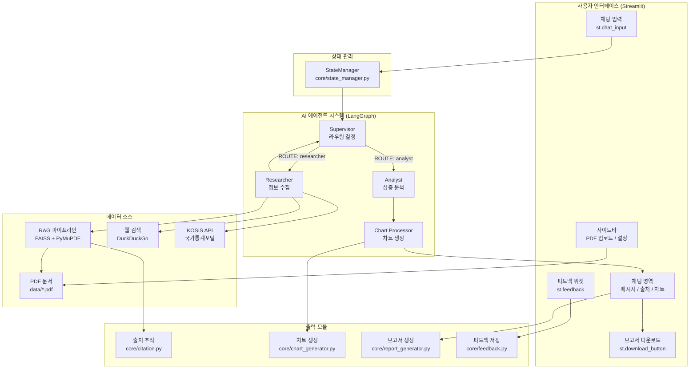

---

## 2. LangGraph 에이전트 워크플로우

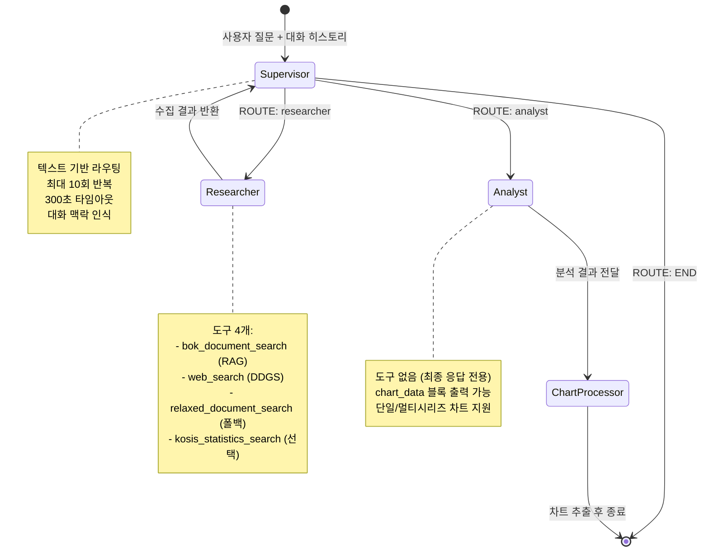

---

## 3. 데이터 워크플로우

### 3.1 사용자 질문 처리 흐름

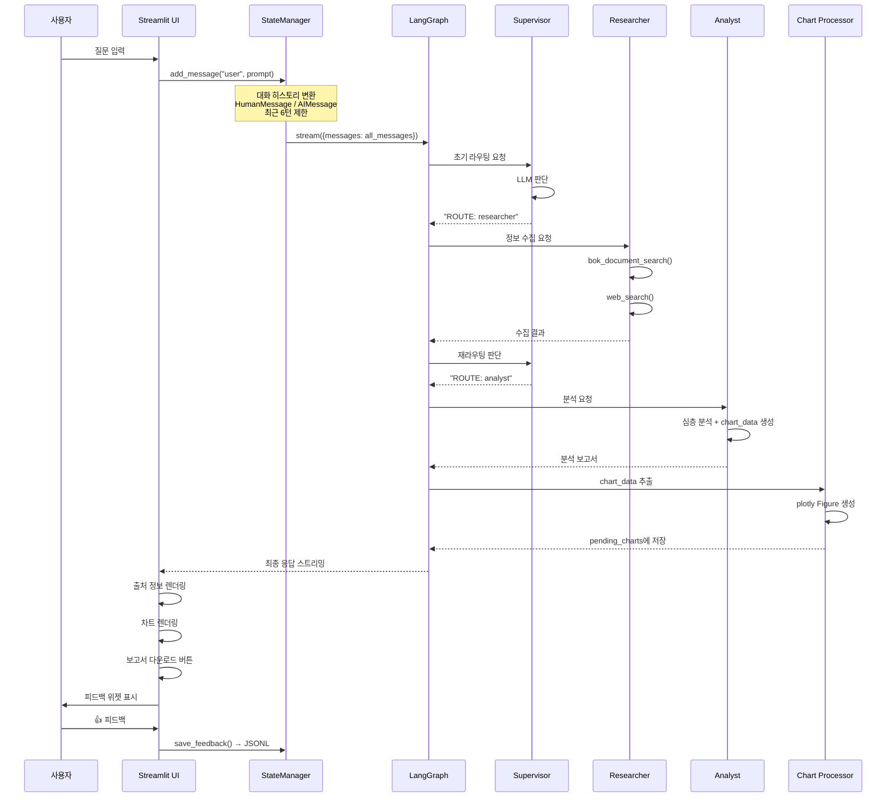

### 3.2 RAG 파이프라인 흐름

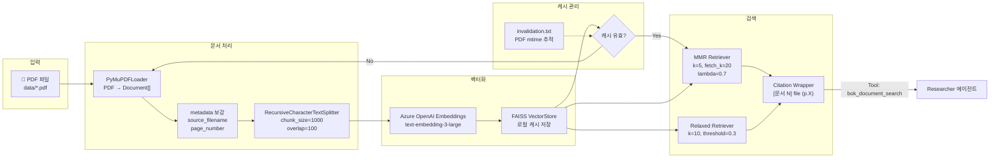

### 3.3 PDF 업로드 → RAG 업데이트 흐름

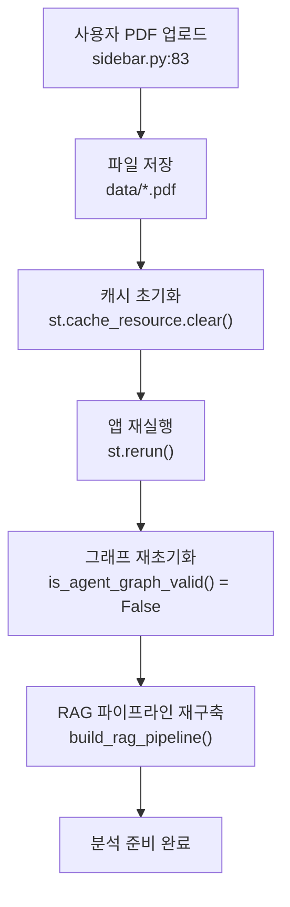

---

## 4. 모듈 의존성 구조

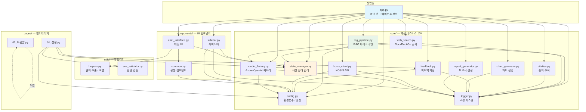

---

## 5. 작동 시나리오

### 시나리오 1: 첫 번째 질문 (그래프 초기화 포함)

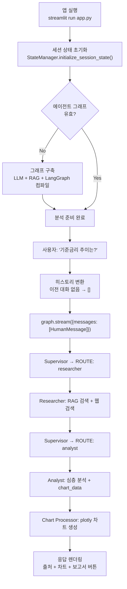

### 시나리오 2: 연속 질문 (대화 맥락 활용)

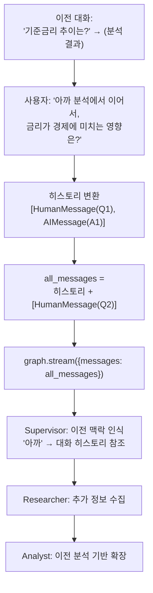

### 시나리오 3: PDF 업로드 후 분석

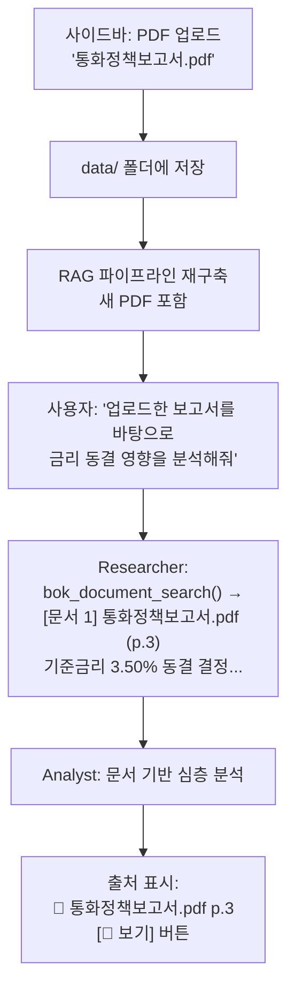

### 시나리오 4: 차트 포함 분석 응답

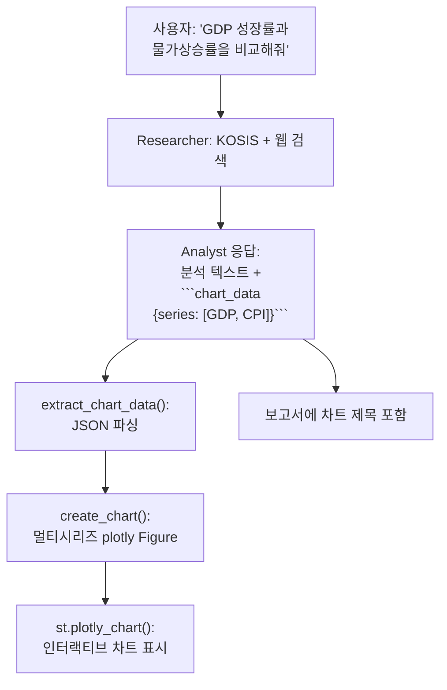

---

## 6. 세션 상태 관리

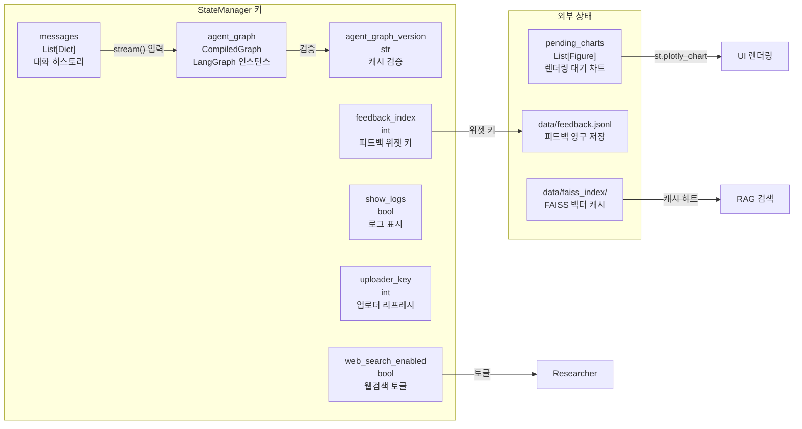

---

## 7. 파일 구조

```
Wiki-multiagents/
├── app.py                          # 메인 앱 + 에이전트 + 그래프 정의
│
├── core/                           # 핵심 비즈니스 로직
│   ├── __init__.py                 # 모듈 export
│   ├── config.py                   # 환경변수 및 설정 (Config 클래스)
│   ├── logger.py                   # 구조화된 로깅
│   ├── model_factory.py            # Azure OpenAI 모델 팩토리 (싱글톤)
│   ├── rag_pipeline.py             # RAG: PDF → FAISS → Retriever
│   ├── state_manager.py            # Streamlit 세션 상태 중앙 관리
│   ├── web_search.py               # DuckDuckGo 웹 검색 + 재시도
│   ├── citation.py                 # Retriever → 출처 포함 텍스트 변환
│   ├── feedback.py                 # 피드백 JSONL 저장/통계
│   ├── chart_generator.py          # LLM 응답 → plotly 차트 변환
│   ├── report_generator.py         # 분석 결과 → Markdown 보고서
│   └── kosis_client.py             # KOSIS 통계청 API 클라이언트
│
├── components/                     # UI 컴포넌트
│   ├── __init__.py
│   ├── sidebar.py                  # 사이드바 (컨트롤/업로드/참고자료)
│   ├── chat_interface.py           # 채팅 메시지 + 출처 렌더링
│   └── common.py                   # 공통 컴포넌트 + PDF 뷰어
│
├── utils/                          # 유틸리티
│   ├── __init__.py
│   ├── helpers.py                  # 출처 추출/포맷/평가
│   └── env_validator.py            # 환경 변수 검증
│
├── pages/                          # Streamlit 멀티페이지
│   ├── 01_⚙️_설정.py              # 설정 + 환경검증 + 피드백통계
│   └── 02_📖_도움말.py            # 사용 가이드 + FAQ
│
├── data/                           # 데이터 저장소
│   ├── *.pdf                       # 업로드된 PDF 문서
│   ├── faiss_index/                # FAISS 벡터 인덱스 캐시
│   └── feedback.jsonl              # 사용자 피드백 기록
│
├── .streamlit/config.toml          # Streamlit 테마/서버 설정
├── requirements.txt                # Python 의존성 (91개 패키지)
├── env.example                     # 환경 변수 템플릿
└── docs/
    ├── ARCHITECTURE.md             # ← 이 문서
    └── plans/                      # 구현 계획 문서
```

---

## 8. 기술 스택 요약

| 레이어 | 기술 | 용도 |
|--------|------|------|
| **UI** | Streamlit | 웹 인터페이스, 멀티페이지 |
| **에이전트 오케스트레이션** | LangGraph (StateGraph) | Supervisor-Worker 패턴 |
| **LLM 프레임워크** | LangChain | 에이전트, 프롬프트, 도구 |
| **LLM** | Azure OpenAI GPT-4o | 추론 엔진 |
| **임베딩** | Azure OpenAI text-embedding-3-large | 문서 벡터화 |
| **벡터DB** | FAISS (로컬) | 유사도 검색 |
| **PDF 처리** | PyMuPDF | PDF → 텍스트 + metadata |
| **웹 검색** | DDGS (DuckDuckGo) | 실시간 정보 수집 |
| **차트** | plotly | 인터랙티브 시각화 |
| **통계 API** | KOSIS | 공공 경제 데이터 |
| **상태 관리** | Streamlit Session State | 대화/그래프/설정 |
| **피드백 저장** | JSONL | 경량 파일 기반 |

---

## 9. 설정 파라미터 참조

| 카테고리 | 변수 | 기본값 | 설명 |
|---------|------|--------|------|
| **Azure** | `AOAI_ENDPOINT` | — | Azure OpenAI 엔드포인트 |
| | `AOAI_API_KEY` | — | API 키 |
| | `AOAI_DEPLOY_GPT4O` | gpt-4o | GPT-4o 배포명 |
| | `AOAI_DEPLOY_EMBED_3_LARGE` | text-embedding-3-large | 임베딩 배포명 |
| **앱** | `MAX_ITERATIONS` | 10 | 에이전트 최대 반복 |
| | `TIMEOUT_SECONDS` | 300 | 실행 타임아웃 |
| | `MAX_HISTORY_TURNS` | 6 | 대화 히스토리 턴 수 |
| **RAG** | `RAG_SEARCH_STRATEGY` | mmr | 검색 전략 (mmr/similarity) |
| | `RAG_K` | 5 | 검색 결과 수 |
| | `RAG_FETCH_K` | 20 | MMR 후보 수 |
| | `RAG_LAMBDA_MULT` | 0.7 | MMR 다양성 계수 |
| | `RAG_SCORE_THRESHOLD` | 0.7 | 유사도 임계값 |
| | `RAG_USE_COMPRESSION` | false | 컨텍스트 압축 |
| **외부** | `KOSIS_API_KEY` | — | KOSIS API 키 (선택) |
| **디버그** | `DEBUG_MODE` | false | 디버그 모드 |
| | `LOG_LEVEL` | INFO | 로그 레벨 |
